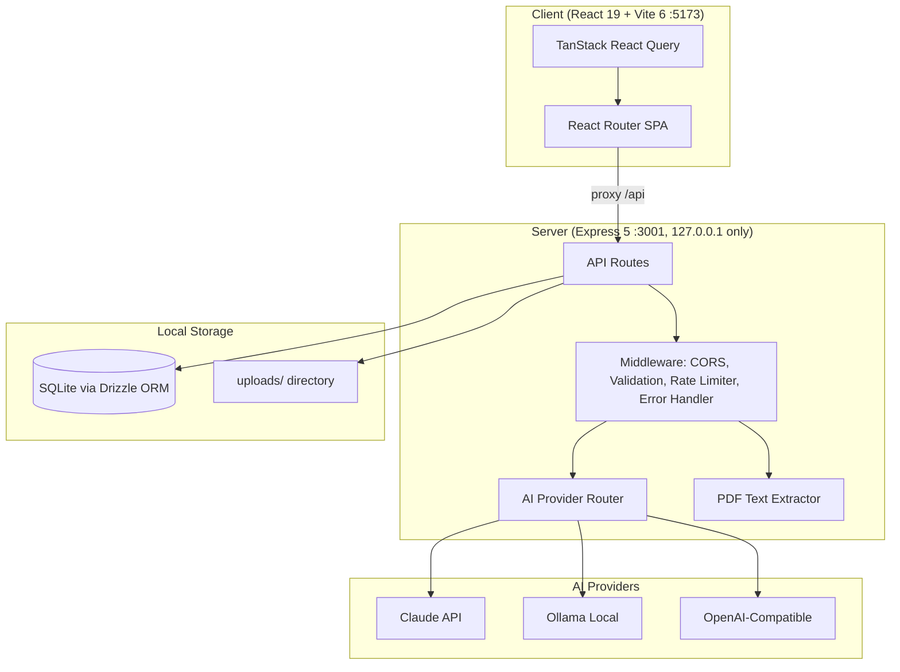

# Architecture — Personal Assistant Home

> Last updated: 2026-03-18 | Updated by: Claude Code

## System Overview
Personal Assistant Home is a privacy-first, self-hosted web app that helps users organise financial, insurance, and health documents. It uses configurable AI providers (Claude API, Ollama, OpenAI-compatible) for document extraction, categorisation, and analysis. All data stays local — Express binds to 127.0.0.1 only.

## Architecture Diagram


## Component Map

| Component | Location | Responsibility | Dependencies |
|-----------|----------|----------------|--------------|
| App Shell | `src/client/app/` | Layout, routing, navigation | react-router-dom, lucide-react |
| Client Logger | `src/client/lib/logger.ts` | Structured logging (client) | — |
| Server Logger | `src/server/lib/logger.ts` | Structured logging (server) | — |
| Express App | `src/server/app.ts` | HTTP server, middleware, routes | express, cors |
| AI Router | `src/server/lib/ai/router.ts` | Routes tasks to configured AI provider | drizzle-orm, ai providers |
| Claude Provider | `src/server/lib/ai/providers/claude.ts` | Claude API integration | @anthropic-ai/sdk |
| Ollama Provider | `src/server/lib/ai/providers/ollama.ts` | Ollama local model integration | ollama |
| OpenAI-Compat Provider | `src/server/lib/ai/providers/openai-compat.ts` | OpenAI-compatible API integration | openai |
| PDF Extractor | `src/server/lib/pdf/extractor.ts` | Text extraction from PDFs | pdf-parse |
| DB Layer | `src/server/lib/db/` | Drizzle ORM + SQLite (WAL mode) | drizzle-orm, better-sqlite3 |
| Error Handler | `src/server/shared/middleware/error-handler.ts` | Consistent error responses | — |
| Rate Limiter | `src/server/shared/middleware/rate-limiter.ts` | AI call rate limiting | — |
| Validation | `src/server/shared/middleware/validate.ts` | Zod-based request validation | zod |
| Shared Types | `src/shared/types/` | Types + zod schemas shared between client/server | zod |

## Data Model

### Core Entities

| Entity | Storage | Key Fields | Relationships |
|--------|---------|------------|---------------|
| Document | `documents` | id, filename, doc_type, processing_status, processed_at, extracted_text, file_path | Has many Transactions, Has one AccountSummary |
| Transaction | `transactions` | id, date, description, amount, type, merchant, is_recurring | Belongs to Document, Belongs to Category |
| Category | `categories` | id, name, parent_id, color, icon, is_default | Has many Transactions, Has many CategoryRules |
| CategoryRule | `category_rules` | id, pattern, field, is_ai_generated, confidence | Belongs to Category |
| AccountSummary | `account_summaries` | id, opening_balance, closing_balance, total_credits, total_debits | Belongs to Document |
| AnalysisSnapshot | `analysis_snapshots` | id, snapshot_type, data, generated_at | — |
| AISetting | `ai_settings` | id, task_type, provider, model, fallback_provider, fallback_model | — |

### Schema Notes
- SQLite in WAL mode for concurrent read performance
- `documents.processed_at` is nullable — set when status transitions to `completed`, used for cache invalidation
- `documents.file_path` is nullable — set to null after upload cleanup (30-day retention)
- `documents.extracted_text` stores raw text from pdf-parse
- `categories` support tree structure via `parent_id`
- `category_rules.is_ai_generated` tracks rules created by AI vs user-defined
- `ai_settings.task_type` is unique — one config per task type

## API Endpoints

| Method | Path | Description | Auth | Status |
|--------|------|-------------|------|--------|
| GET | `/api/health` | Health check | No | Active |

## External Integrations

| Service | Purpose | Config | Rate Limits | Error Handling |
|---------|---------|--------|-------------|----------------|
| Claude API | AI extraction, categorisation, analysis | `ANTHROPIC_API_KEY` in .env.local | 30 req/min (app-side limiter) | Retry not implemented; fallback to configured fallback provider |
| Ollama | Local AI processing | `OLLAMA_BASE_URL` (default localhost:11434) | No limit | Check availability before use |
| OpenAI-compatible | Third-party AI providers | `OPENAI_API_KEY`, `OPENAI_BASE_URL` | 30 req/min (app-side limiter) | Same as Claude |

## Error Handling Strategy

### Error Flow
```
Client Error  -> Error Boundary -> Logger -> User-friendly message
API Error     -> try-catch -> Logger -> Consistent JSON error response
Service Error -> try-catch -> Logger -> Retry (if applicable) -> Propagate
```

### API Error Response Format
```json
{ "error": { "code": "RESOURCE_NOT_FOUND", "message": "Human-readable description" } }
```

### Custom Error Class
`AppError(statusCode, code, message)` — thrown in routes, caught by error handler middleware.

## Security

### Secret Management
- All secrets in `.env.local` (never committed)
- `.env.example` maintained with placeholders
- Server-side only — never in client bundle
- Pre-commit scan (CLAUDE.md Rule 1) includes `sk-ant-` for Anthropic keys

### Input Validation
- Zod schemas for all request bodies (`src/shared/types/validation.ts`)
- `validateBody()` middleware wraps zod parsing with AppError on failure

### Network Security
- Express binds to `127.0.0.1` only — never `0.0.0.0`
- Only AI API calls leave the machine
- CORS restricted to `http://localhost:5173`

### Deployment Security
- CI runs on every PR: `typecheck` + `lint` + `test` + secret scan — blocks merge on failure
- CD runs on merge to `main`: build + deploy
- Branch protection on `main`: merges require CI to pass

## Feature Log

| Feature | Date | Key Decisions | Files Changed |
|---------|------|---------------|---------------|
| Project Scaffolding | 2026-03-18 | Initial setup from Claude_BestPractise template; npm as package manager; Claude API as AI provider | All initial files |
| Phase 0: CLAUDE.md Completion | 2026-03-18 | Filled TBD fields, updated structure, added sk-ant- scan, configured .env.example and .gitignore | CLAUDE.md, .env.example, .gitignore |
| Phase 1A: Foundation | 2026-03-18 | React 19 + Vite 6 + Express 5 + Tailwind CSS 4 + Drizzle ORM/SQLite + AI provider router (Claude/Ollama/OpenAI-compat) + PDF extractor (pdf-parse v2) + Vitest dual projects + ESLint | All src/ files, config files |

---
_Maintained by Claude Code per CLAUDE.md Rule 4._
