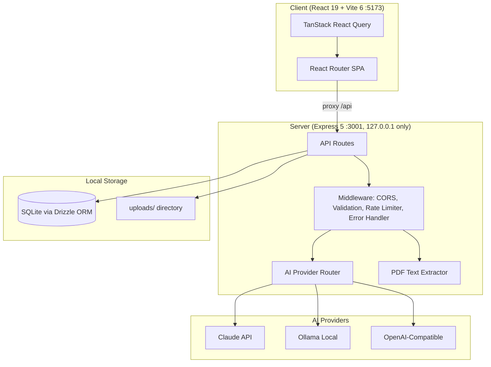

# Architecture — Personal Assistant Home

> Last updated: 2026-03-22 (Goal Tracking) | Updated by: Claude Code

## System Overview
Personal Assistant Home is a privacy-first, self-hosted web app that helps users organise financial, insurance, and health documents. It uses configurable AI providers (Claude API, Ollama, OpenAI-compatible) for document extraction, categorisation, and analysis. All data stays local — Express binds to 127.0.0.1 only.

## Architecture Diagram


## Component Map

| Component | Location | Responsibility | Dependencies |
|-----------|----------|----------------|--------------|
| App Shell | `src/client/app/` | Layout, routing, navigation | react-router-dom, lucide-react |
| Client Logger | `src/client/lib/logger.ts` | Structured logging (client) | — |
| Server Logger | `src/server/lib/logger.ts` | Structured logging (server) | — |
| Express App | `src/server/app.ts` | HTTP server, middleware, routes | express, cors |
| AI Router | `src/server/lib/ai/router.ts` | Routes tasks to configured AI provider | drizzle-orm, ai providers |
| Claude Provider | `src/server/lib/ai/providers/claude.ts` | Claude API integration | @anthropic-ai/sdk |
| Ollama Provider | `src/server/lib/ai/providers/ollama.ts` | Ollama local model integration | ollama |
| OpenAI-Compat Provider | `src/server/lib/ai/providers/openai-compat.ts` | OpenAI-compatible API integration | openai |
| PDF Extractor | `src/server/lib/pdf/extractor.ts` | Text extraction from PDFs | pdf-parse |
| DB Layer | `src/server/lib/db/` | Drizzle ORM + SQLite (WAL mode) | drizzle-orm, better-sqlite3 |
| Error Handler | `src/server/shared/middleware/error-handler.ts` | Consistent error responses | — |
| Rate Limiter | `src/server/shared/middleware/rate-limiter.ts` | AI call rate limiting | — |
| Validation | `src/server/shared/middleware/validate.ts` | Zod-based request validation | zod |
| Shared Types | `src/shared/types/` | Types + zod schemas shared between client/server | zod |
| Transactions (Server) | `src/server/features/transactions/` | Transaction filtering/search/pagination, rule-based + AI categorisation, category CRUD, bulk operations | drizzle-orm, uuid, zod |
| Categorisation Engine | `src/server/features/transactions/categorisation.service.ts` | Rule-based regex matching against category rules, batch categorisation | drizzle-orm |
| AI Categorisation | `src/server/features/transactions/ai-categorisation.service.ts` | AI-assisted categorisation via Haiku, auto-rule generation | ai-router, zod |
| Transactions (Client) | `src/client/features/transactions/` | Transaction table with filtering/sorting/pagination, category management modal, bulk actions, stats dashboard | @tanstack/react-query, lucide-react |
| Document Processor | `src/server/features/document-processor/` | PDF upload, AI extraction pipeline, vision reprocessing, file cleanup | multer, pdf-lib, ai-router, @anthropic-ai/sdk |
| Upload Middleware | `src/server/features/document-processor/upload.middleware.ts` | Multer PDF upload (10MB limit, UUID naming) | multer |
| Extraction Service | `src/server/features/document-processor/extraction.service.ts` | Async pipeline: split → extract text → AI → validate → dedup → DB write | pdf-parse, ai-router, drizzle-orm |
| Vision Service | `src/server/features/document-processor/vision.service.ts` | Claude Vision reprocessing for scanned PDFs | @anthropic-ai/sdk |
| Cleanup Service | `src/server/features/document-processor/cleanup.service.ts` | Daily cleanup of expired upload files (30-day retention) | — |
| Document Upload UI | `src/client/features/document-upload/` | Upload dropzone, document list/detail, AI settings panel | react-dropzone, @tanstack/react-query |
| App Settings (Server) | `src/server/features/settings/` | Key-value app settings CRUD, DB stats, bulk data deletion | drizzle-orm, zod |
| Settings (Client) | `src/client/features/settings/` | Settings page: currency selector, CSV export, data management (bulk delete, re-seed categories), DB stats/about | @tanstack/react-query, lucide-react |
| Dashboard (Client) | `src/client/features/dashboard/` | Financial overview: summary cards, category pie chart, monthly trend chart, recent transactions, date range filtering (purely presentational — hooks live in settings feature) | recharts, @tanstack/react-query, lucide-react |
| Currency Formatter | `src/client/shared/utils/format-currency.ts` | Shared `Intl.NumberFormat` wrapper with caching | — |
| DateRangePicker | `src/client/shared/components/date-range-picker.tsx` | Shared date range selector with presets (This Month, Last 3/6 Months, This Year, All Time) and custom range | lucide-react |
| Accounts (Server) | `src/server/features/accounts/` | Account CRUD, net-worth calculation, balance recalculation, transaction/document account assignment | drizzle-orm, uuid, zod |
| Accounts (Client) | `src/client/features/accounts/` | Account list page, account form modal, AccountSelector dropdown, AccountOverview dashboard widget | @tanstack/react-query, lucide-react |
| NavSection | `src/client/app/layout.tsx` | Collapsible sidebar navigation groups with localStorage persistence | lucide-react |
| ErrorBoundary | `src/client/shared/components/error-boundary.tsx` | Root-level React error boundary — catches uncaught errors, shows fallback UI with retry/reload, logs via client logger | lucide-react |
| Budgets (Server) | `src/server/features/budgets/` | Budget CRUD with per-category spending limits, period-aware spend calculation (monthly/weekly/yearly) | drizzle-orm, uuid, zod |
| Budgets (Client) | `src/client/features/budgets/` | Budget settings page (CRUD), dashboard progress widget with color-coded bars | @tanstack/react-query, lucide-react |
| Analysis (Server) | `src/server/features/analysis/` | AI spending insights generation, merchant aggregation, snapshot CRUD, retry on AI parse failure | drizzle-orm, uuid, zod, ai-router |
| Recurring Detection | `src/server/features/transactions/recurring-detection.service.ts` | Groups debit transactions by merchant, detects recurring patterns (3+ occurrences, consistent amounts/intervals), classifies frequency, marks isRecurring flag | drizzle-orm |
| Recurring (Client) | `src/client/features/recurring/` | Dashboard summary card (estimated monthly recurring total with frequency normalization), grouped panel for transactions page | @tanstack/react-query, lucide-react |
| Tags (Server) | `src/server/features/tags/` | Tag CRUD with usage counts, transaction-tag junction operations, split transaction CRUD with sum validation, budget-aware spend calculation | drizzle-orm, uuid, zod |
| Tags (Client) | `src/client/features/tags/` | TagManager modal (CRUD with color picker), TagSelector multi-select, TagBadge display, SplitTransactionModal | @tanstack/react-query, lucide-react |
| Analysis (Client) | `src/client/features/analysis/` | Analysis page: generate panel, section cards with Markdown rendering, snapshot history | @tanstack/react-query, react-markdown, lucide-react |
| Import (Server) | `src/server/features/import/` | CSV/OFX/QIF file parsing, import session management, column mapping, duplicate detection (reuses buildTransactionKey), batch transaction creation, undo | papaparse, multer, drizzle-orm, uuid, zod |
| Import (Client) | `src/client/features/import/` | 4-step import wizard (upload, column mapping, preview with dedup, confirm), import history with undo | @tanstack/react-query, lucide-react |
| Bills (Server) | `src/server/features/bills/` | Bill CRUD, mark-paid date advancement (frequency-based), calendar view, auto-populate from recurring detection | drizzle-orm, uuid, zod |
| Bills (Client) | `src/client/features/bills/` | Bills page with list/calendar toggle, bill form modal, dashboard upcoming bills widget, overdue/due-soon highlighting, mark-paid | @tanstack/react-query, lucide-react |
| Goals (Server) | `src/server/features/goals/` | Goal CRUD, contribution management, balance sync from linked accounts, status transitions (active/completed/cancelled) | drizzle-orm, uuid, zod |
| Goals (Client) | `src/client/features/goals/` | Goals page with cards grid, goal form modal, contribute modal, dashboard progress widget (top 3 active goals) | @tanstack/react-query, lucide-react |

## Data Model

### Core Entities

| Entity | Storage | Key Fields | Relationships |
|--------|---------|------------|---------------|
| Document | `documents` | id, filename, doc_type, processing_status, processed_at, extracted_text, file_path | Has many Transactions, Has one AccountSummary |
| Transaction | `transactions` | id, date, description, amount, type, merchant, is_recurring | Belongs to Document (nullable), Belongs to Category, Belongs to ImportSession (nullable) |
| Category | `categories` | id, name, parent_id, color, icon, is_default | Has many Transactions, Has many CategoryRules |
| CategoryRule | `category_rules` | id, pattern, field, is_ai_generated, confidence | Belongs to Category |
| AccountSummary | `account_summaries` | id, opening_balance, closing_balance, total_credits, total_debits | Belongs to Document |
| AnalysisSnapshot | `analysis_snapshots` | id, snapshot_type, data, generated_at | — |
| AppSetting | `app_settings` | key (PK), value | — |
| AISetting | `ai_settings` | id, task_type, provider, model, fallback_provider, fallback_model | — |
| Budget | `budgets` | id, category_id (unique), amount, period | Belongs to Category (ON DELETE CASCADE) |
| Tag | `tags` | id, name (unique), color | Has many Transactions (via transaction_tags) |
| TransactionTag | `transaction_tags` | transactionId, tagId (composite unique) | Junction: Transaction ↔ Tag (ON DELETE CASCADE both) |
| SplitTransaction | `split_transactions` | id, parentTransactionId, categoryId, amount, description | Belongs to Transaction (ON DELETE CASCADE), Belongs to Category (ON DELETE SET NULL) |
| ImportSession | `import_sessions` | id, filename, file_type, status, total_rows, imported_rows, duplicate_rows | Has many Transactions, Belongs to Account (nullable) |
| Account | `accounts` | id, name, type, institution, currency, current_balance, is_active | Has many Transactions, Has many Documents |
| Bill | `bills` | id, name, expectedAmount, frequency, nextDueDate, isActive, notes | Belongs to Account (nullable), Belongs to Category (nullable) |
| Goal | `goals` | id, name, targetAmount, currentAmount, deadline, status | Belongs to Account (nullable), Belongs to Category (nullable), Has many GoalContributions |
| GoalContribution | `goal_contributions` | id, goalId, amount, note, date | Belongs to Goal (ON DELETE CASCADE) |

### Schema Notes
- SQLite in WAL mode for concurrent read performance
- `documents.processed_at` is nullable — set when status transitions to `completed`, used for cache invalidation
- `documents.file_path` is nullable — set to null after upload cleanup (30-day retention)
- `documents.extracted_text` stores raw text from pdf-parse
- `categories` support tree structure via `parent_id`
- `category_rules.is_ai_generated` tracks rules created by AI vs user-defined
- `app_settings` is a key-value store — seeded with `currency: AUD`
- `ai_settings.task_type` is unique — one config per task type
- `accounts.currentBalance` is manual entry — not auto-updated on transaction changes
- `accounts.type` constrains to checking/savings/credit_card/investment
- `transactions.accountId` and `documents.accountId` are nullable FKs (ON DELETE SET NULL) — backward-compatible
- `transactions.isSplit` is an explicit flag for budget double-counting prevention; `previousCategoryId` stores original categoryId when split (restored on unsplit)
- `split_transactions` amounts must sum to parent transaction amount; budget spend queries UNION splits with unsplit transactions
- `transactions.documentId` is nullable — imported transactions have no source document
- `transactions.importSessionId` is nullable FK (ON DELETE SET NULL) — links imported transactions to their import session for undo
- `import_sessions` tracks upload metadata, column mapping (JSON), row counts, and status (pending/mapped/previewed/completed/failed)
- `bills.nextDueDate` advances on mark-paid (no isPaid column — overdue = nextDueDate < today)
- `bills.frequency` constrains to weekly/biweekly/monthly/quarterly/yearly
- `goals.status` constrains to active/completed/cancelled — transitions managed via PUT
- `goals.currentAmount` is updated by contributions and sync-balance — not auto-calculated
- `goal_contributions` amounts sum to `goals.currentAmount`; sync-balance inserts balancing contributions to maintain this invariant
- `goals.accountId` enables sync-balance; warns when multiple goals share an account

## API Endpoints

| Method | Path | Description | Auth | Status |
|--------|------|-------------|------|--------|
| GET | `/api/health` | Health check | No | Active |
| POST | `/api/documents/upload` | Upload PDF + trigger async extraction | No | Active |
| GET | `/api/documents` | List documents (optional ?status, ?docType filters) | No | Active |
| GET | `/api/documents/:id` | Get single document | No | Active |
| GET | `/api/documents/:id/transactions` | Get transactions for document | No | Active |
| POST | `/api/documents/:id/reprocess-vision` | Trigger Claude Vision re-processing (rate limited) | No | Active |
| DELETE | `/api/documents/:id` | Delete document + file + transactions | No | Active |
| GET | `/api/ai-settings` | List all AI settings | No | Active |
| PUT | `/api/ai-settings/:taskType` | Update AI provider/model for task type | No | Active |
| GET | `/api/transactions` | List transactions with filtering, sorting, pagination | No | Active |
| GET | `/api/transactions/stats` | Aggregated stats (income/expenses/by-category/by-month) | No | Active |
| PUT | `/api/transactions/:id` | Update transaction category | No | Active |
| POST | `/api/transactions/bulk-categorise` | Bulk assign category to multiple transactions | No | Active |
| POST | `/api/transactions/auto-categorise` | Trigger rule-based categorisation (rate limited) | No | Active |
| POST | `/api/transactions/ai-categorise` | Trigger AI categorisation (fire-and-forget, rate limited) | No | Active |
| GET | `/api/categories` | List all categories with transaction counts | No | Active |
| POST | `/api/categories` | Create category | No | Active |
| PUT | `/api/categories/:id` | Update category | No | Active |
| DELETE | `/api/categories/:id` | Delete category (uncategorises transactions, cascades rules) | No | Active |
| GET | `/api/categories/:id/rules` | List rules for category | No | Active |
| POST | `/api/categories/rules` | Create category rule (validates regex) | No | Active |
| DELETE | `/api/categories/rules/:id` | Delete category rule | No | Active |
| GET | `/api/settings/app` | List all app settings as key-value pairs | No | Active |
| PUT | `/api/settings/app/:key` | Update app setting (validates currency codes) | No | Active |
| GET | `/api/settings/stats` | DB stats: document/transaction/category counts, DB size, app version | No | Active |
| DELETE | `/api/data/all` | Bulk delete all transactions, account summaries, documents, and uploaded files (requires `{ confirm: true }`) | No | Active |
| GET | `/api/transactions/export/csv` | CSV export with optional `?from=&to=` date range | No | Active |
| POST | `/api/categories/re-seed` | Drop all categories and re-seed defaults (requires `{ confirm: true }`) | No | Active |
| POST | `/api/analysis/generate` | Generate AI spending analysis for date range | No (rate limited) | Active |
| GET | `/api/analysis/snapshots` | List past analysis snapshots (metadata + period via JSON_EXTRACT) | No | Active |
| GET | `/api/analysis/snapshots/:id` | Get full snapshot with insights data | No | Active |
| DELETE | `/api/analysis/snapshots/:id` | Delete an analysis snapshot | No | Active |
| GET | `/api/budgets` | List all budgets with category info | No | Active |
| GET | `/api/budgets/summary` | Budgets with current period spend calculation | No | Active |
| POST | `/api/budgets` | Create budget for a category | No | Active |
| PUT | `/api/budgets/:id` | Update budget amount/period | No | Active |
| DELETE | `/api/budgets/:id` | Delete a budget | No | Active |
| POST | `/api/transactions/detect-recurring` | Run recurring detection algorithm, update isRecurring flags, return groups | No | Active |
| GET | `/api/transactions/recurring-summary` | Grouped recurring transactions: merchant, avg amount, frequency, next expected date | No | Active |
| GET | `/api/accounts` | List accounts (optional ?isActive filter) | No | Active |
| GET | `/api/accounts/net-worth` | Sum balances across active accounts (credit_card as negative) | No | Active |
| GET | `/api/accounts/:id` | Get single account with transaction count | No | Active |
| POST | `/api/accounts` | Create account | No | Active |
| PUT | `/api/accounts/:id` | Update account | No | Active |
| DELETE | `/api/accounts/:id` | Soft-delete; ?hard=true for hard delete | No | Active |
| POST | `/api/accounts/:id/recalculate` | Recalculate balance from linked transactions | No | Active |
| PUT | `/api/transactions/:id/account` | Assign transaction to account | No | Active |
| POST | `/api/transactions/bulk-assign-account` | Bulk assign | No | Active |
| GET | `/api/tags` | List tags with usage counts | No | Active |
| POST | `/api/tags` | Create tag | No | Active |
| PUT | `/api/tags/:id` | Update tag | No | Active |
| DELETE | `/api/tags/:id` | Delete tag (cascades junction rows) | No | Active |
| POST | `/api/transactions/:id/tags` | Add tags to transaction | No | Active |
| DELETE | `/api/transactions/:id/tags/:tagId` | Remove tag from transaction | No | Active |
| POST | `/api/transactions/bulk-tag` | Bulk add tag to multiple transactions | No | Active |
| GET | `/api/transactions/:id/splits` | Get splits for a transaction | No | Active |
| POST | `/api/transactions/:id/splits` | Create/replace splits (validates sum = parent amount) | No | Active |
| DELETE | `/api/transactions/:id/splits` | Remove all splits, restore categoryId | No | Active |

| POST | `/api/import/upload` | Upload CSV/OFX/QIF file, create session, parse, return preview | No | Active |
| PUT | `/api/import/:id/mapping` | Save column mapping (CSV), re-parse, return preview | No | Active |
| GET | `/api/import/:id/preview` | Get parsed rows with duplicate flags | No | Active |
| POST | `/api/import/:id/confirm` | Commit selected rows as transactions | No | Active |
| DELETE | `/api/import/:id/undo` | Delete all transactions from import session | No | Active |
| GET | `/api/import/sessions` | List import sessions | No | Active |
| DELETE | `/api/import/:id` | Delete import session and its transactions | No | Active |
| GET | `/api/bills` | List bills (optional `?isActive`, `?upcoming=N` for next N days) | No | Active |
| GET | `/api/bills/calendar` | Bills grouped by date (`?from=&to=`) | No | Active |
| POST | `/api/bills/populate-from-recurring` | Auto-create bills from recurring detection data | No | Active |
| GET | `/api/bills/:id` | Get single bill | No | Active |
| POST | `/api/bills` | Create bill | No | Active |
| PUT | `/api/bills/:id` | Update bill | No | Active |
| DELETE | `/api/bills/:id` | Delete bill | No | Active |
| POST | `/api/bills/:id/mark-paid` | Advance nextDueDate to next occurrence | No | Active |
| GET | `/api/goals` | List goals (optional `?status=active`) | No | Active |
| GET | `/api/goals/:id` | Get goal with contributions | No | Active |
| POST | `/api/goals` | Create goal | No | Active |
| PUT | `/api/goals/:id` | Update goal (name, target, deadline, account, category, status) | No | Active |
| DELETE | `/api/goals/:id` | Delete goal (cascades contributions) | No | Active |
| POST | `/api/goals/:id/contribute` | Add contribution, update currentAmount | No | Active |
| POST | `/api/goals/:id/sync-balance` | Sync currentAmount from linked account balance | No | Active |

## External Integrations

| Service | Purpose | Config | Rate Limits | Error Handling |
|---------|---------|--------|-------------|----------------|
| Claude API | AI extraction, categorisation, analysis | `ANTHROPIC_API_KEY` in .env.local | 30 req/min (app-side limiter) | Retry not implemented; fallback to configured fallback provider |
| Ollama | Local AI processing | `OLLAMA_BASE_URL` (default localhost:11434) | No limit | Check availability before use |
| OpenAI-compatible | Third-party AI providers | `OPENAI_API_KEY`, `OPENAI_BASE_URL` | 30 req/min (app-side limiter) | Same as Claude |

## Error Handling Strategy

### Error Flow
```
Client Error  -> Error Boundary -> Logger -> User-friendly message
API Error     -> try-catch -> Logger -> Consistent JSON error response
Service Error -> try-catch -> Logger -> Retry (if applicable) -> Propagate
```

### API Error Response Format
```json
{ "error": { "code": "RESOURCE_NOT_FOUND", "message": "Human-readable description" } }
```

### Custom Error Class
`AppError(statusCode, code, message)` — thrown in routes, caught by error handler middleware.

## Security

### Secret Management
- All secrets in `.env.local` (never committed)
- `.env.example` maintained with placeholders
- Server-side only — never in client bundle
- Pre-commit scan (CLAUDE.md Rule 1) includes `sk-ant-` for Anthropic keys

### Input Validation
- Zod schemas for all request bodies (`src/shared/types/validation.ts`)
- `validateBody()` middleware wraps zod parsing with AppError on failure

### Network Security
- Express binds to `127.0.0.1` only — never `0.0.0.0`
- Only AI API calls leave the machine
- CORS restricted to `http://localhost:5173`

### Deployment Security
- CI runs on every PR: `typecheck` + `lint` + `test` + secret scan — blocks merge on failure
- CD runs on merge to `main`: build + deploy
- Branch protection on `main`: merges require CI to pass

## Feature Log

| Feature | Date | Key Decisions | Files Changed |
|---------|------|---------------|---------------|
| Project Scaffolding | 2026-03-18 | Initial setup from Claude_BestPractise template; npm as package manager; Claude API as AI provider | All initial files |
| Phase 0: CLAUDE.md Completion | 2026-03-18 | Filled TBD fields, updated structure, added sk-ant- scan, configured .env.example and .gitignore | CLAUDE.md, .env.example, .gitignore |
| Phase 1A: Foundation | 2026-03-18 | React 19 + Vite 6 + Express 5 + Tailwind CSS 4 + Drizzle ORM/SQLite + AI provider router (Claude/Ollama/OpenAI-compat) + PDF extractor (pdf-parse v2) + Vitest dual projects + ESLint | All src/ files, config files |
| Phase 1B: Document Upload | 2026-03-19 | PDF upload + async AI extraction pipeline + Vision reprocessing for scanned docs + file cleanup service + React Query polling + 8 new API endpoints | `src/server/features/document-processor/`, `src/client/features/document-upload/`, shared types, app.ts, index.ts, seed.ts, page stubs |
| Phase 1C: Transactions | 2026-03-19 | Transaction browsing/filtering/search/pagination + two-tier categorisation (rule-based + AI Haiku) + category management (CRUD, hierarchical, rules) + bulk operations + auto-rule generation + stats dashboard + 14 new API endpoints | `src/server/features/transactions/`, `src/client/features/transactions/`, shared types, validation, validate.ts, app.ts, seed.ts, extraction/vision hooks |
| Phase 1D: Dashboard | 2026-03-19 | Financial overview dashboard with Recharts (category pie chart, monthly trend bar chart) + configurable currency via app_settings table + date range filtering (presets + custom) + recent transactions list + shared formatCurrency utility + StatsSummary retrofit + 2 new API endpoints | `src/client/features/dashboard/`, `src/server/features/settings/`, `src/client/shared/utils/`, schema, seed, app.ts, dashboard.tsx, stats-summary.tsx |
| Phase 1E: Analysis | 2026-03-20 | AI spending insights analysis page: backend service with merchant aggregation, system message in messages array, retry on AI parse failure, snapshot CRUD with JSON_EXTRACT for list period; frontend with generate panel, Markdown section cards (react-markdown), snapshot history; promoted DateRangePicker to shared components; currency selector on Settings page; 4 new API endpoints | `src/server/features/analysis/`, `src/client/features/analysis/`, `src/client/shared/components/`, shared types, app.ts, analysis.tsx, settings.tsx |
| Phase 1F: Settings | 2026-03-20 | Settings page completion: promoted settings hooks/API from dashboard to new client settings feature module; extracted CurrencySelector component; CSV transaction export with date range filtering; data management (bulk delete all data with FK-ordered deletion, re-seed default categories with transaction nullification, re-run categorisation); DB stats endpoint (counts, DB size, app version); extracted reusable seedDefaultCategories function; 4 new API endpoints | `src/client/features/settings/`, `src/server/features/settings/routes.ts`, `src/server/features/transactions/routes.ts`, `src/server/features/transactions/category.routes.ts`, `src/server/lib/db/seed-categories.ts`, `src/server/lib/db/seed.ts`, `src/client/app/pages/settings.tsx`, `src/client/app/pages/dashboard.tsx`, `src/client/features/transactions/components/stats-summary.tsx` |
| Phase 1 Polish: Error Boundary | 2026-03-20 | Root-level React ErrorBoundary class component (React 19 requires class for getDerivedStateFromError); wraps app outside QueryClientProvider; fallback UI with retry/reload; logs via client logger; also fixed document-processor test isolation (added beforeEach cleanup) | `src/client/shared/components/error-boundary.tsx` (new), `src/client/main.tsx`, `src/server/features/document-processor/routes.test.ts` |
| Phase 1 Polish: Dashboard Pagination | 2026-03-20 | Added pagination controls to dashboard recent transactions list; reuses existing server-side pagination (page/pageSize on GET /api/transactions); lightweight ChevronLeft/ChevronRight nav shown only when totalPages > 1 | `src/client/app/pages/dashboard.tsx`, `src/client/features/dashboard/components/recent-transactions.tsx` |
| Budget Goals | 2026-03-20 | Separate `budgets` table (one-to-one with categories, ON DELETE CASCADE); period-aware spend calculation (monthly/weekly/yearly); budget settings on own `/budgets` page (not in sidebar nav, accessible via Settings); dashboard progress widget with color-coded bars (green/amber/red); 5 new API endpoints | `src/server/features/budgets/` (new), `src/client/features/budgets/` (new), schema, shared types/validation, app.tsx, dashboard.tsx, settings.tsx |
| Recurring Detection | 2026-03-20 | Manual-trigger recurring detection: groups debits by merchant, requires 3+ occurrences with consistent amounts (10% tolerance) and intervals (±5 days), classifies frequency (weekly/biweekly/monthly/quarterly/yearly), marks isRecurring flag; client recurring module with dashboard summary card (frequency-normalized monthly total) and grouped panel (shown on transactions page when isRecurring filter active); 2 new API endpoints | `src/server/features/transactions/recurring-detection.service.ts` (new), `src/client/features/recurring/` (new), shared types, transactions-page.tsx, dashboard.tsx |
| Mobile Responsiveness | 2026-03-20 | Collapsible sidebar with hamburger menu for mobile (<lg breakpoint); overlay with backdrop, focus trap, Escape key close, aria-modal/aria-hidden accessibility; responsive main padding (p-4/p-6/p-8); 44px min touch targets on pagination; hidden merchant/source columns in transaction table on mobile; hidden institution/transactions/date columns in document table on mobile; responsive filter bar stacking; button wrapping on transactions page header | layout.tsx, transaction-table.tsx, transaction-filters.tsx, transactions-page.tsx, document-list.tsx, budget-settings.tsx, recent-transactions.tsx, date-range-picker.tsx, app.test.tsx |
| Multi-Account Tracking (Phase 2A) | 2026-03-21 | accounts table with nullable accountId FK on transactions/documents; sidebar redesign with NavSection collapsible groups; credit card balance stored positive, treated negative for net-worth; soft-delete by default, hard-delete only if zero linked transactions; currentBalance is manual with optional recalculate endpoint; 9 new API endpoints | `src/server/features/accounts/`, `src/client/features/accounts/`, `src/client/app/layout.tsx`, `src/shared/types/`, schema, app.ts, app.tsx, dashboard.tsx, transaction routes |
| Tags / Split Transactions (Phase 2D) | 2026-03-21 | 3 new tables (tags, transaction_tags, split_transactions); isSplit + previousCategoryId columns on transactions; tag CRUD with usage counts; transaction-tag junction with bulk operations; split validation (sum = parent); budget spend UNION with splits for double-counting prevention; category change blocked on split transactions; TagManager modal from Settings; SplitTransactionModal; 11 new API endpoints | `src/server/features/tags/`, `src/client/features/tags/`, shared types/validation, schema, budgets routes, transactions routes, settings page, app.ts, server-setup.ts |

| Data Import CSV/OFX/QIF (Phase 2E) | 2026-03-21 | import_sessions table; transactions.documentId nullable + importSessionId FK; hand-written OFX/QIF parsers (no npm deps); papaparse for CSV with auto-detect column mapping; 4-step wizard (upload → mapping → preview with dedup → confirm); dedup reuses buildTransactionKey from document-processor; undo via session-linked batch delete; in-memory session cache for wizard state; 7 new API endpoints | `src/server/features/import/`, `src/client/features/import/`, schema, shared types/validation, app.ts, app.tsx, layout.tsx, settings.tsx, server-setup.ts |
| Upcoming Bills (Phase 2B) | 2026-03-22 | bills table with frequency-based scheduling; mark-paid advances nextDueDate (no isPaid column); auto-populate from recurring detection with duplicate skip (name+10% amount tolerance); calendar endpoint groups by date; overdue/due-soon highlighting; list/calendar toggle view; dashboard upcoming bills widget (7 days); 8 new API endpoints | `src/server/features/bills/`, `src/client/features/bills/`, schema, shared types/validation, app.ts, app.tsx, layout.tsx, dashboard.tsx |

| Goal Tracking (Phase 2F) | 2026-03-22 | goals and goal_contributions tables; contribution management with currentAmount tracking; sync-balance from linked accounts with multi-goal warning; status transitions (active/completed/cancelled); GoalCard with progress bar; GoalProgressWidget dashboard widget (top 3 active); 7 new API endpoints | `src/server/features/goals/`, `src/client/features/goals/`, schema, shared types/validation, app.ts, app.tsx, layout.tsx, dashboard.tsx |

---
_Maintained by Claude Code per CLAUDE.md Rule 4._
