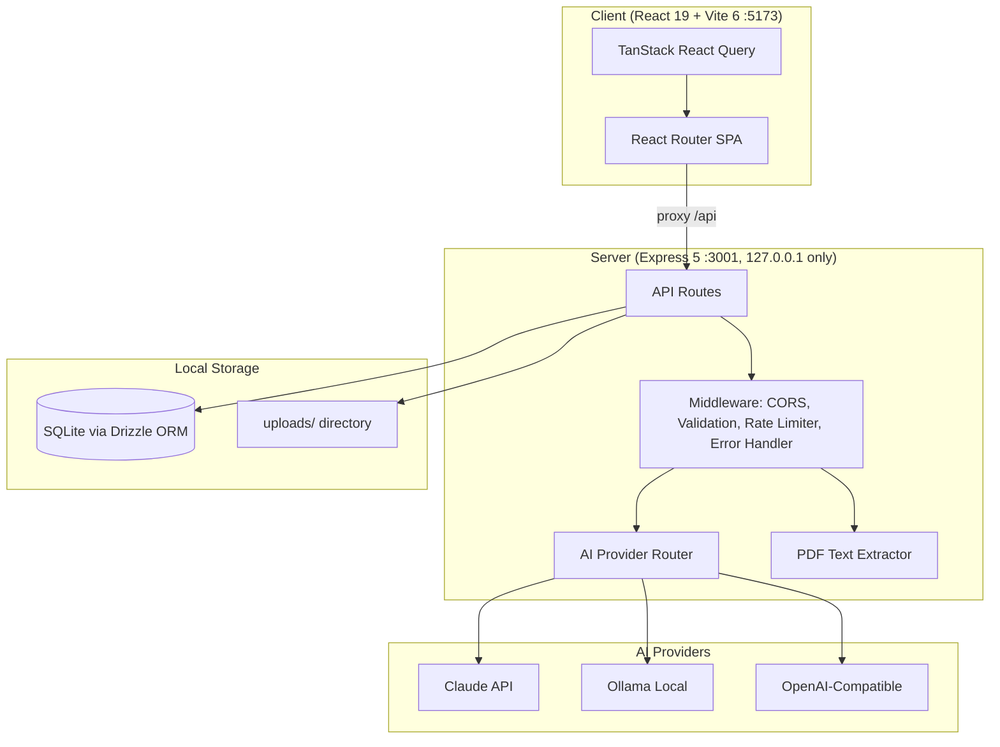

# Architecture — Personal Assistant Home

> Last updated: 2026-03-20 (Phase 1E) | Updated by: Claude Code

## System Overview
Personal Assistant Home is a privacy-first, self-hosted web app that helps users organise financial, insurance, and health documents. It uses configurable AI providers (Claude API, Ollama, OpenAI-compatible) for document extraction, categorisation, and analysis. All data stays local — Express binds to 127.0.0.1 only.

## Architecture Diagram


## Component Map

| Component | Location | Responsibility | Dependencies |
|-----------|----------|----------------|--------------|
| App Shell | `src/client/app/` | Layout, routing, navigation | react-router-dom, lucide-react |
| Client Logger | `src/client/lib/logger.ts` | Structured logging (client) | — |
| Server Logger | `src/server/lib/logger.ts` | Structured logging (server) | — |
| Express App | `src/server/app.ts` | HTTP server, middleware, routes | express, cors |
| AI Router | `src/server/lib/ai/router.ts` | Routes tasks to configured AI provider | drizzle-orm, ai providers |
| Claude Provider | `src/server/lib/ai/providers/claude.ts` | Claude API integration | @anthropic-ai/sdk |
| Ollama Provider | `src/server/lib/ai/providers/ollama.ts` | Ollama local model integration | ollama |
| OpenAI-Compat Provider | `src/server/lib/ai/providers/openai-compat.ts` | OpenAI-compatible API integration | openai |
| PDF Extractor | `src/server/lib/pdf/extractor.ts` | Text extraction from PDFs | pdf-parse |
| DB Layer | `src/server/lib/db/` | Drizzle ORM + SQLite (WAL mode) | drizzle-orm, better-sqlite3 |
| Error Handler | `src/server/shared/middleware/error-handler.ts` | Consistent error responses | — |
| Rate Limiter | `src/server/shared/middleware/rate-limiter.ts` | AI call rate limiting | — |
| Validation | `src/server/shared/middleware/validate.ts` | Zod-based request validation | zod |
| Shared Types | `src/shared/types/` | Types + zod schemas shared between client/server | zod |
| Transactions (Server) | `src/server/features/transactions/` | Transaction filtering/search/pagination, rule-based + AI categorisation, category CRUD, bulk operations | drizzle-orm, uuid, zod |
| Categorisation Engine | `src/server/features/transactions/categorisation.service.ts` | Rule-based regex matching against category rules, batch categorisation | drizzle-orm |
| AI Categorisation | `src/server/features/transactions/ai-categorisation.service.ts` | AI-assisted categorisation via Haiku, auto-rule generation | ai-router, zod |
| Transactions (Client) | `src/client/features/transactions/` | Transaction table with filtering/sorting/pagination, category management modal, bulk actions, stats dashboard | @tanstack/react-query, lucide-react |
| Document Processor | `src/server/features/document-processor/` | PDF upload, AI extraction pipeline, vision reprocessing, file cleanup | multer, pdf-lib, ai-router, @anthropic-ai/sdk |
| Upload Middleware | `src/server/features/document-processor/upload.middleware.ts` | Multer PDF upload (10MB limit, UUID naming) | multer |
| Extraction Service | `src/server/features/document-processor/extraction.service.ts` | Async pipeline: split → extract text → AI → validate → dedup → DB write | pdf-parse, ai-router, drizzle-orm |
| Vision Service | `src/server/features/document-processor/vision.service.ts` | Claude Vision reprocessing for scanned PDFs | @anthropic-ai/sdk |
| Cleanup Service | `src/server/features/document-processor/cleanup.service.ts` | Daily cleanup of expired upload files (30-day retention) | — |
| Document Upload UI | `src/client/features/document-upload/` | Upload dropzone, document list/detail, AI settings panel | react-dropzone, @tanstack/react-query |
| App Settings (Server) | `src/server/features/settings/` | Key-value app settings CRUD with currency validation | drizzle-orm, zod |
| Dashboard (Client) | `src/client/features/dashboard/` | Financial overview: summary cards, category pie chart, monthly trend chart, recent transactions, date range filtering | recharts, @tanstack/react-query, lucide-react |
| Currency Formatter | `src/client/shared/utils/format-currency.ts` | Shared `Intl.NumberFormat` wrapper with caching | — |
| DateRangePicker | `src/client/shared/components/date-range-picker.tsx` | Shared date range selector with presets (This Month, Last 3/6 Months, This Year, All Time) and custom range | lucide-react |
| Analysis (Server) | `src/server/features/analysis/` | AI spending insights generation, merchant aggregation, snapshot CRUD, retry on AI parse failure | drizzle-orm, uuid, zod, ai-router |
| Analysis (Client) | `src/client/features/analysis/` | Analysis page: generate panel, section cards with Markdown rendering, snapshot history | @tanstack/react-query, react-markdown, lucide-react |

## Data Model

### Core Entities

| Entity | Storage | Key Fields | Relationships |
|--------|---------|------------|---------------|
| Document | `documents` | id, filename, doc_type, processing_status, processed_at, extracted_text, file_path | Has many Transactions, Has one AccountSummary |
| Transaction | `transactions` | id, date, description, amount, type, merchant, is_recurring | Belongs to Document, Belongs to Category |
| Category | `categories` | id, name, parent_id, color, icon, is_default | Has many Transactions, Has many CategoryRules |
| CategoryRule | `category_rules` | id, pattern, field, is_ai_generated, confidence | Belongs to Category |
| AccountSummary | `account_summaries` | id, opening_balance, closing_balance, total_credits, total_debits | Belongs to Document |
| AnalysisSnapshot | `analysis_snapshots` | id, snapshot_type, data, generated_at | — |
| AppSetting | `app_settings` | key (PK), value | — |
| AISetting | `ai_settings` | id, task_type, provider, model, fallback_provider, fallback_model | — |

### Schema Notes
- SQLite in WAL mode for concurrent read performance
- `documents.processed_at` is nullable — set when status transitions to `completed`, used for cache invalidation
- `documents.file_path` is nullable — set to null after upload cleanup (30-day retention)
- `documents.extracted_text` stores raw text from pdf-parse
- `categories` support tree structure via `parent_id`
- `category_rules.is_ai_generated` tracks rules created by AI vs user-defined
- `app_settings` is a key-value store — seeded with `currency: AUD`
- `ai_settings.task_type` is unique — one config per task type

## API Endpoints

| Method | Path | Description | Auth | Status |
|--------|------|-------------|------|--------|
| GET | `/api/health` | Health check | No | Active |
| POST | `/api/documents/upload` | Upload PDF + trigger async extraction | No | Active |
| GET | `/api/documents` | List documents (optional ?status, ?docType filters) | No | Active |
| GET | `/api/documents/:id` | Get single document | No | Active |
| GET | `/api/documents/:id/transactions` | Get transactions for document | No | Active |
| POST | `/api/documents/:id/reprocess-vision` | Trigger Claude Vision re-processing (rate limited) | No | Active |
| DELETE | `/api/documents/:id` | Delete document + file + transactions | No | Active |
| GET | `/api/ai-settings` | List all AI settings | No | Active |
| PUT | `/api/ai-settings/:taskType` | Update AI provider/model for task type | No | Active |
| GET | `/api/transactions` | List transactions with filtering, sorting, pagination | No | Active |
| GET | `/api/transactions/stats` | Aggregated stats (income/expenses/by-category/by-month) | No | Active |
| PUT | `/api/transactions/:id` | Update transaction category | No | Active |
| POST | `/api/transactions/bulk-categorise` | Bulk assign category to multiple transactions | No | Active |
| POST | `/api/transactions/auto-categorise` | Trigger rule-based categorisation (rate limited) | No | Active |
| POST | `/api/transactions/ai-categorise` | Trigger AI categorisation (fire-and-forget, rate limited) | No | Active |
| GET | `/api/categories` | List all categories with transaction counts | No | Active |
| POST | `/api/categories` | Create category | No | Active |
| PUT | `/api/categories/:id` | Update category | No | Active |
| DELETE | `/api/categories/:id` | Delete category (uncategorises transactions, cascades rules) | No | Active |
| GET | `/api/categories/:id/rules` | List rules for category | No | Active |
| POST | `/api/categories/rules` | Create category rule (validates regex) | No | Active |
| DELETE | `/api/categories/rules/:id` | Delete category rule | No | Active |
| GET | `/api/settings/app` | List all app settings as key-value pairs | No | Active |
| PUT | `/api/settings/app/:key` | Update app setting (validates currency codes) | No | Active |
| POST | `/api/analysis/generate` | Generate AI spending analysis for date range | No (rate limited) | Active |
| GET | `/api/analysis/snapshots` | List past analysis snapshots (metadata + period via JSON_EXTRACT) | No | Active |
| GET | `/api/analysis/snapshots/:id` | Get full snapshot with insights data | No | Active |
| DELETE | `/api/analysis/snapshots/:id` | Delete an analysis snapshot | No | Active |

## External Integrations

| Service | Purpose | Config | Rate Limits | Error Handling |
|---------|---------|--------|-------------|----------------|
| Claude API | AI extraction, categorisation, analysis | `ANTHROPIC_API_KEY` in .env.local | 30 req/min (app-side limiter) | Retry not implemented; fallback to configured fallback provider |
| Ollama | Local AI processing | `OLLAMA_BASE_URL` (default localhost:11434) | No limit | Check availability before use |
| OpenAI-compatible | Third-party AI providers | `OPENAI_API_KEY`, `OPENAI_BASE_URL` | 30 req/min (app-side limiter) | Same as Claude |

## Error Handling Strategy

### Error Flow
```
Client Error  -> Error Boundary -> Logger -> User-friendly message
API Error     -> try-catch -> Logger -> Consistent JSON error response
Service Error -> try-catch -> Logger -> Retry (if applicable) -> Propagate
```

### API Error Response Format
```json
{ "error": { "code": "RESOURCE_NOT_FOUND", "message": "Human-readable description" } }
```

### Custom Error Class
`AppError(statusCode, code, message)` — thrown in routes, caught by error handler middleware.

## Security

### Secret Management
- All secrets in `.env.local` (never committed)
- `.env.example` maintained with placeholders
- Server-side only — never in client bundle
- Pre-commit scan (CLAUDE.md Rule 1) includes `sk-ant-` for Anthropic keys

### Input Validation
- Zod schemas for all request bodies (`src/shared/types/validation.ts`)
- `validateBody()` middleware wraps zod parsing with AppError on failure

### Network Security
- Express binds to `127.0.0.1` only — never `0.0.0.0`
- Only AI API calls leave the machine
- CORS restricted to `http://localhost:5173`

### Deployment Security
- CI runs on every PR: `typecheck` + `lint` + `test` + secret scan — blocks merge on failure
- CD runs on merge to `main`: build + deploy
- Branch protection on `main`: merges require CI to pass

## Feature Log

| Feature | Date | Key Decisions | Files Changed |
|---------|------|---------------|---------------|
| Project Scaffolding | 2026-03-18 | Initial setup from Claude_BestPractise template; npm as package manager; Claude API as AI provider | All initial files |
| Phase 0: CLAUDE.md Completion | 2026-03-18 | Filled TBD fields, updated structure, added sk-ant- scan, configured .env.example and .gitignore | CLAUDE.md, .env.example, .gitignore |
| Phase 1A: Foundation | 2026-03-18 | React 19 + Vite 6 + Express 5 + Tailwind CSS 4 + Drizzle ORM/SQLite + AI provider router (Claude/Ollama/OpenAI-compat) + PDF extractor (pdf-parse v2) + Vitest dual projects + ESLint | All src/ files, config files |
| Phase 1B: Document Upload | 2026-03-19 | PDF upload + async AI extraction pipeline + Vision reprocessing for scanned docs + file cleanup service + React Query polling + 8 new API endpoints | `src/server/features/document-processor/`, `src/client/features/document-upload/`, shared types, app.ts, index.ts, seed.ts, page stubs |
| Phase 1C: Transactions | 2026-03-19 | Transaction browsing/filtering/search/pagination + two-tier categorisation (rule-based + AI Haiku) + category management (CRUD, hierarchical, rules) + bulk operations + auto-rule generation + stats dashboard + 14 new API endpoints | `src/server/features/transactions/`, `src/client/features/transactions/`, shared types, validation, validate.ts, app.ts, seed.ts, extraction/vision hooks |
| Phase 1D: Dashboard | 2026-03-19 | Financial overview dashboard with Recharts (category pie chart, monthly trend bar chart) + configurable currency via app_settings table + date range filtering (presets + custom) + recent transactions list + shared formatCurrency utility + StatsSummary retrofit + 2 new API endpoints | `src/client/features/dashboard/`, `src/server/features/settings/`, `src/client/shared/utils/`, schema, seed, app.ts, dashboard.tsx, stats-summary.tsx |
| Phase 1E: Analysis | 2026-03-20 | AI spending insights analysis page: backend service with merchant aggregation, system message in messages array, retry on AI parse failure, snapshot CRUD with JSON_EXTRACT for list period; frontend with generate panel, Markdown section cards (react-markdown), snapshot history; promoted DateRangePicker to shared components; currency selector on Settings page; 4 new API endpoints | `src/server/features/analysis/`, `src/client/features/analysis/`, `src/client/shared/components/`, shared types, app.ts, analysis.tsx, settings.tsx |

---
_Maintained by Claude Code per CLAUDE.md Rule 4._
